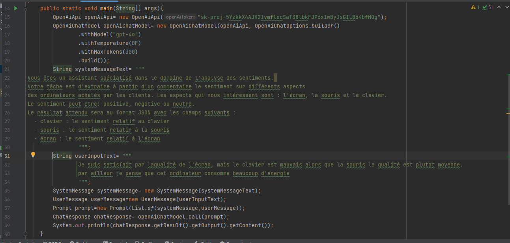
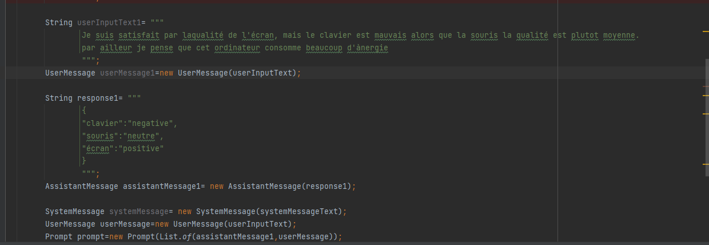
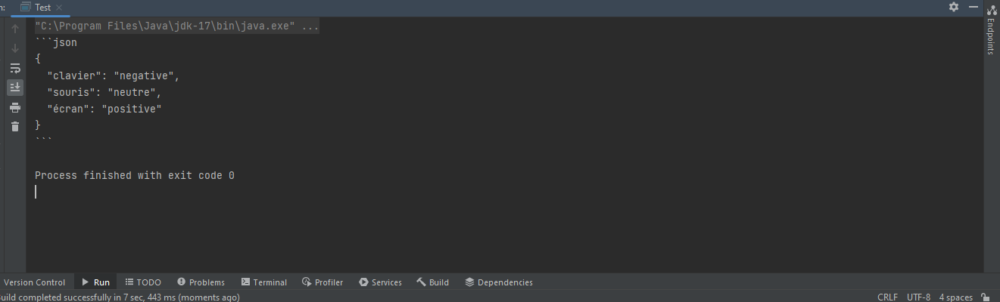
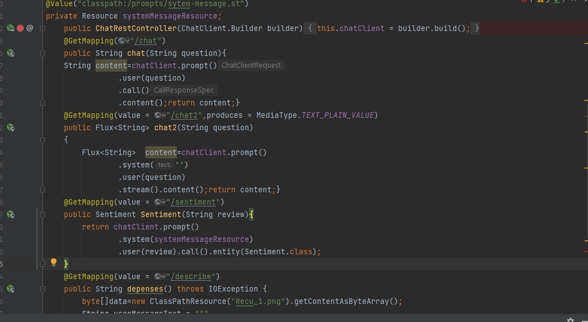
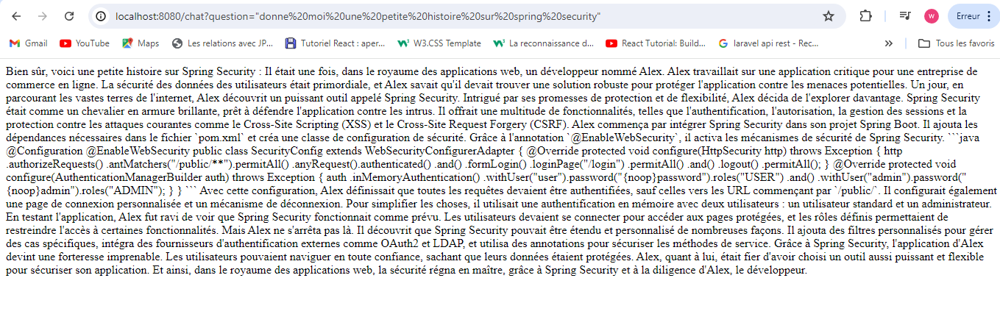

# Prompt Engineering using Spring AI
Application basée sur Spring utilisant Prompt Engineering, permettant aux utilisateurs de poser des questions sur l'analyse des sentiments et de recevoir instantanément des réponses précises.

## Code utilisant ZeroPrompt pour l'analyse du sentiment

## Code utilisant du Few-Shot Prompt pour analyser le sentiment

## Resultat obtenu avec les deux types de prompt

## Code utiliser pour le RestController

## Exemple de resultat du prompt en utilisant le restcontroller
